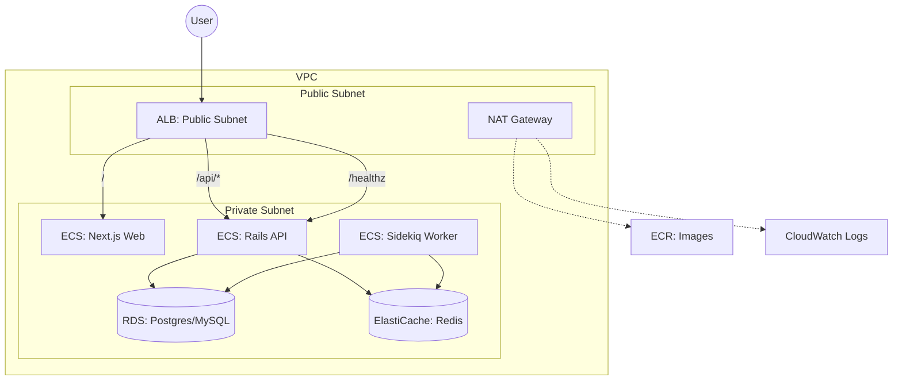

# AWS Catch-up 🚀

このプロジェクトは、AWSをキャッチアップしプロダクションレディーなアーキテクチャを構築するためのサンプルリポジトリです。

## 🏛 構成の全体像

「入口はALB」「実行はECS」「状態はRDS」という、Rails + Next.js等のWebアプリで最も汎用的な構成を採用しています。



## 💎 現場っぽさのポイント（ここが語れる）

- **State管理**: S3 Backend (`use_lockfile=true`) を使用し、ローカルに状態を置かないプロ仕様。
- **CI/CD OIDC**: GitHub ActionsにAWS鍵を置かず、OIDCによる一時認証でセキュアに連携。
- **ネットワーク分離**: ALB以外は全てPrivate Subnetに配置し、NAT Gateway経由で外部通信を行うセキュア設計。
- **リリース安全性**: ECSのDeployment Circuit Breakerを有効化し、デプロイ失敗時の自動ロールバックを実現。
- **秘匿情報管理**: Secrets Managerを使用し、環境変数をコードに直書きしない運用。
- **撤収の容易さ**: `force_delete=true` や `skip_final_snapshot=true` を設定し、検証後すぐに `terraform destroy` で全消し可能。

---

## 🛠 セットアップと前提条件

再現性を確保するため、以下のツールと環境設定が必要です。

### 1. 必要なツール (Local CLI)

| ツール | 推奨バージョン | インストール方法 (macOS) | 役割 |
| :--- | :--- | :--- | :--- |
| **Homebrew** | Latest | `/bin/bash -c "$(curl -fsSL https://raw.githubusercontent.com/Homebrew/install/HEAD/install.sh)"` | パッケージ管理 |
| **Terraform** | `1.5.7` | `brew install terraform@1.5.7` | インフラのコード化 (IaC) |
| **AWS CLI** | `2.x` | `brew install awscli` | AWSリソースの操作 |
| **Docker** | Latest | `brew install --cask docker` | コンテナビルド |
| **jq** | Latest | `brew install jq` | JSON操作 (デプロイスクリプトで使用) |
| **gh** | Latest | `brew install gh` | GitHub Actions の Secret/Variable 設定 |
| **Make** | Latest | (macOS標準) | 作業コマンドの抽象化 |

### 2. AWS認証設定 (重要)

インフラ作成には、以下のいずれかの方法で認証が完了している必要があります。

#### 方法A: 認証プロファイル (推奨)
```bash
aws configure --profile aws-terraform-sample
# インタラクティブに Access Key / Secret Key / Region (ap-northeast-1) を入力
```

#### 方法B: 環境変数
シェルに以下の環境変数をセットしてください。
```bash
export AWS_ACCESS_KEY_ID="AKIA..."
export AWS_SECRET_ACCESS_KEY="wJalrXUtn..."
export AWS_DEFAULT_REGION="ap-northeast-1"
```

### 3. GitHub Actions 連携用環境変数 (Variables & Secrets)

GitHubリポジトリの **Settings > Secrets and variables > Actions** または `gh` コマンドで設定してください。

#### Variables (一般設定)
| キー | 設定値の例 | 説明 |
| :--- | :--- | :--- |
| `AWS_REGION` | `ap-northeast-1` | 使用するリージョン |
| `AWS_ROLE_ARN` | `arn:aws:iam::...:role/...` | Bootstrapで作成されたGHA用ロールARN |
| `PROJECT` | `aws-terraform-sample` | リソース識別用のプロジェクト名 |
| `ENV` | `dev` | 環境名 |

#### Secrets (機密情報)
| キー | 設定値の例 | 説明 |
| :--- | :--- | :--- |
| `AWS_ACCOUNT_ID` | `123456789012` | AWSのアカウントID |

#### `gh` コマンドでの設定例
```bash
gh variable set AWS_REGION --body "ap-northeast-1"
gh variable set PROJECT --body "aws-terraform-sample"
gh secret set AWS_ACCOUNT_ID --body "123456789012"
```

---

## 🚀 実行フロー

### Phase 1: Bootstrap
```bash
# infra/bootstrap/terraform.tfvars を作成後
make bootstrap-apply
```

### Phase 2: Dev Environment
1. `infra/envs/dev/backend.tf` の `bucket` 名を書き換える。
2. インフラ展開:
   ```bash
   make apply
   ```
2. 完了後、出力された `alb_url` をブラウザで開き、"web ok" が表示されれば疎通完了です。

### 5. Phase 4: CI/CDの有効化
GitHubの **Settings -> Secrets and variables -> Actions** に以下を設定します。

- **Variables**:
  - `AWS_REGION`: ap-northeast-1
  - `AWS_ROLE_ARN`: メモした Role ARN
  - `PROJECT`: riskdog-sample
  - `ENV`: dev
- **Secrets**:
  - `AWS_ACCOUNT_ID`: あなたのAWSアカウントID

これで、PR作成で `Plan`、マージで `Apply` が走るようになります。

---

## 🧹 撤収 (削除)

検証が終わったら、無駄な課金を防ぐために必ず削除してください。

```bash
make destroy-all
```

削除順序は `dev環境` -> `bootstrap` の順で行われます。

---

## 🔒 セキュリティと公開時の注意

このプロジェクトを利用する場合は以下の点に注意してください。

1. **`.gitignore` の徹底**: すでに作成済みですが、`terraform.tfstate` や `*.tfvars` が Git に含まれないようにしてください。これらにはインフラ構成や一時的な機密が含まれる可能性があります。
2. **Account ID の非公開**: `README` 等に自分の AWS Account ID を直書きしないようにしましょう（本プロジェクトでは変数化を推奨しています）。
3. **IAM 権限の最小化**: 現在は検証をスムーズにするため `AdministratorAccess` を付与していますが、実運用や長期公開時には、Terraform が必要とする最小限の権限（VPC操作, ECS操作等）に絞ることを推奨します。
4. **Secrets Manager の活用**: DBパスワードなどは環境変数に直接書かず、必ず Secrets Manager 経由で注入する構成を維持してください。
